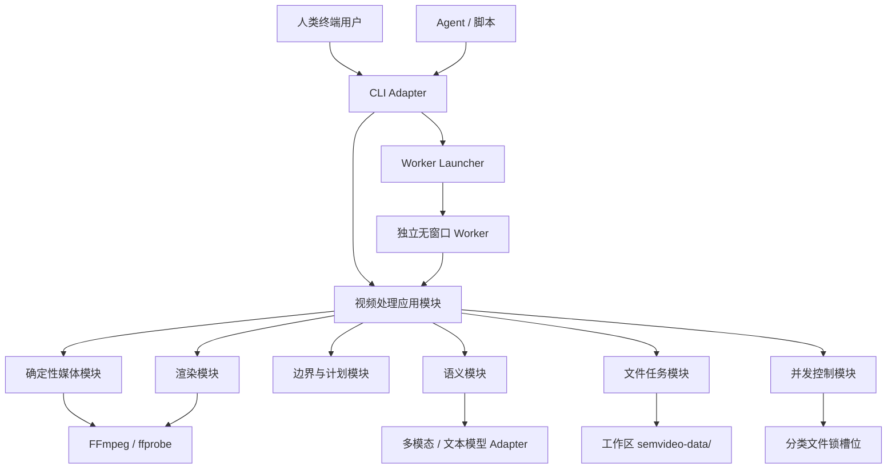
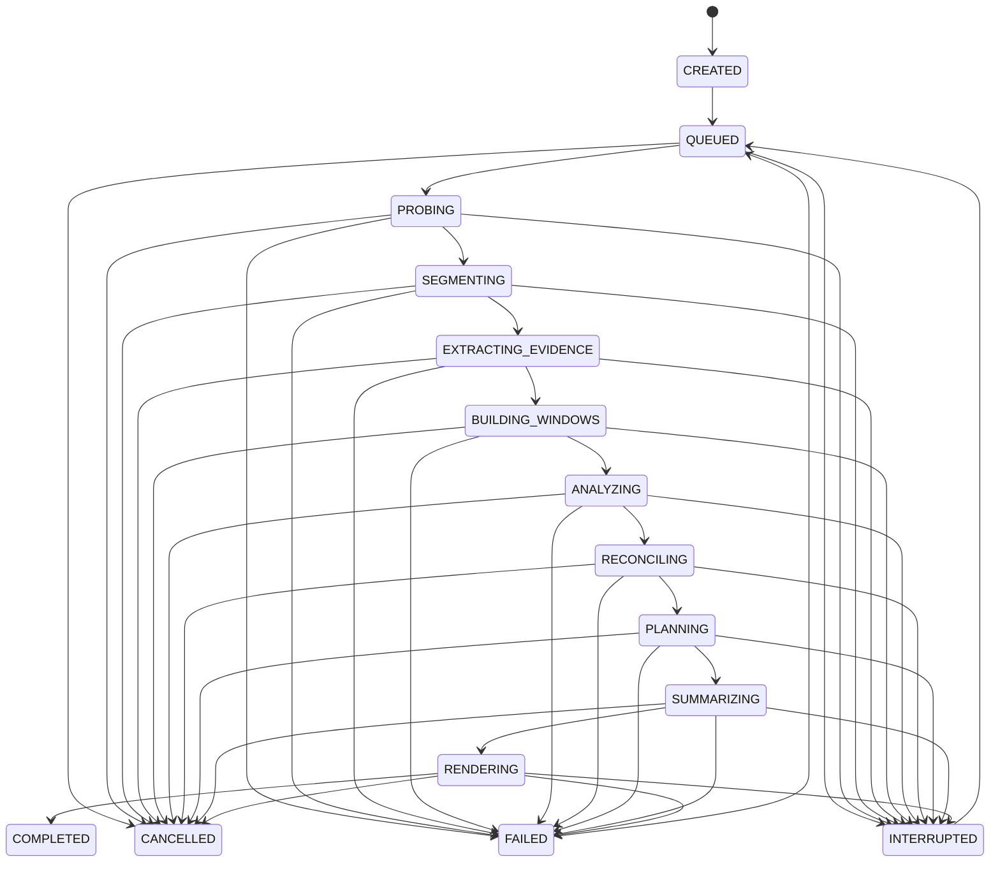

# 系统架构

## 1. 架构目标

系统把一个源视频转换为可追溯的正式片段、结构化摘要和可选媒体文件。V1 是面向本地 Agent 自动化的 CLI 工具，不包含前端、常驻 HTTP 服务或数据库任务队列。CLI 调用结束后，耗时任务由独立的无窗口 Worker 继续执行；任务事实持久化在自描述任务目录中。

架构优先保证：

- 每个正式片段都能追溯到源视频时间范围及支持它的证据。
- 概率性的模型判断与确定性的媒体执行分离。
- 长任务可观察、可取消、可恢复，失败后不必从头处理。
- 模型、Prompt、算法或文件实现可以替换，而不会改变领域模型。
- 中间产物可以人工检查，便于评估过度切分和错误合并。
- CLI、Worker 和未来可能出现的 HTTP 服务复用同一应用 Interface。
- 不依赖常驻内存状态，也不要求终端窗口持续存在。

## 2. 范围

### V1 产品范围

- 本地视频文件输入，默认复制到当前视频处理工作区的受管 `sources/` 目录。
- 每个视频处理工作区在自身根目录的 `semvideo-data/` 中保存全部任务数据；不同 Agent 会话共享工作区，不同工作区互相隔离。
- 通过内容哈希识别同一源文件；同一个源视频可以创建多个处理任务。
- 单视频提交和多个视频并行处理。
- 确定性候选边界、候选片段和证据时间线。
- 关键帧、时序九宫格、字幕/语音转写、OCR 等时间对齐证据。
- 短视频单窗口、长视频重叠窗口的多模态语义分段。
- 协调窗口提案，并在需要时局部复核候选边界。
- 生成合并计划、正式片段及正式摘要。
- 为每个正式片段生成检索片段记录，供外部搜索 Module 或 Agent Skill 消费。
- 自描述文件任务、阶段检查点、结构化事件日志和可选独立视频导出。
- 独立无窗口 Worker、文件锁并发控制，以及 CLI 查询、取消、恢复、重试、检查和导出。
- 自包含的本地检查报告。

### V1 暂不包含

- 实时流媒体处理。
- 非相邻片段自动拼接成主题视频。
- 查询理解、关键词/向量索引、相关性评分和 Top-K 排名。
- 多用户、权限、计费和云端协作。
- 分布式调度和横向扩容。
- 前端及人工操作服务。
- 常驻 HTTP 服务、自动启动服务和服务心跳。
- SQLite 或其他数据库任务队列。
- 开机后自动恢复任务；V1 由 Agent 显式查询并恢复中断任务。
- 自动删除源视频或产物。

## 3. 系统上下文



CLI 和 Worker 只跨越“视频处理应用模块”的 Interface。FFmpeg、模型提供商、文件布局、进程启动和锁实现是内部 Adapter。未来若出现持续人工操作需求，可以在同一 Interface 外增加有状态 HTTP 服务，而不改变核心流水线，也不让服务解析 CLI 文本。

当前方案更准确的名称是“无常驻服务”，而不是“整个工具无状态”：每次 CLI 调用无需依赖常驻内存，但任务状态、阶段检查点和事件会持久化到当前工作区。Agent 会话不是持久化边界；同一工作区的新会话能够继续查询和恢复既有任务。

## 4. 端到端流水线


| 阶段 | 主要输入 | 主要输出 | 失败恢复原则 |
|---|---|---|---|
| 接收 | 路径、处理策略 | 任务定义、受管源引用 | 内容哈希去重，任务创建保持幂等 |
| 探测 | 源视频 | 媒体事实、内容指纹 | 结果可缓存 |
| 切分 | 媒体事实、视频流 | 候选边界、候选片段 | 相同算法版本应可重现 |
| 镜头语言 | 镜头时间线、镜头内连续帧 | 视点、景别、运镜过程和关键词 | 本地测量可重现；模型输出必须审计和校验 |
| 证据 | 候选时间线、视频流 | 证据时间线、九宫格、转写 | 按产物独立缓存和重试 |
| 窗口 | 证据时间线、处理策略 | 可重叠证据窗口 | 相同策略版本应可重现 |
| 语义 | 证据窗口 | 语义分段提案、模型运行 | 按输入哈希和模型版本缓存 |
| 协调 | 多窗口提案、候选时间线 | 统一边界判断 | 冲突和不确定结果进入复核 |
| 计划 | 候选片段、统一边界判断 | 合并计划 | 验证失败不得执行 |
| 正式片段 | 已验证计划 | 正式片段记录 | 纯数据推导，可重建 |
| 摘要 | 正式片段及其证据 | 正式摘要 | 单正式片段可重试 |
| 检索投影 | 正式片段、摘要、转写和产物引用 | 检索片段记录目录 | 纯数据投影，可重建 |
| 渲染 | 正式片段时间范围 | 视频/封面等产物 | 临时输出完成校验后原子登记 |
| 完成 | 全部阶段结果 | 任务清单 | 清单最后写入 |

每个阶段成功时写入阶段检查点。检查点至少记录 Schema 版本、实现版本、配置哈希、上游输入哈希和输出校验值。恢复时必须验证检查点，不能只根据输出文件存在判断成功。

## 5. 模块分块

### 5.1 视频处理应用模块

这是 CLI、Worker 和测试共同使用的外部 Module。它隐藏阶段顺序、缓存、重试、模型调用和文件持久化细节。

```text
initialize_workspace(root, options?) -> WorkspaceRef
create_job(request) -> JobId
launch_job(job_id) -> ProcessingAttempt
run_job(job_id, attempt_id, progress_sink) -> JobResult
get_job(job_id) -> JobSnapshot
cancel_job(job_id) -> JobSnapshot
resume_job(job_id, from_stage?) -> ProcessingAttempt
retry_job(job_id, from_stage?) -> ProcessingAttempt
get_job_admission() -> JobAdmissionSnapshot
```

`submit_job`、`resume_job` 和 `retry_job` 在同一工作区 `submit.lock` 内重新计算任务
准入并完成任务创建或 Worker 启动。准入把 `concurrency.media` 作为 V1 的保守活跃
任务上限；`created` 也算已经预留的活跃任务。Skill 读取快照只用于编排批次，不能
自行复制终态集合或承担最终校验。即使多个 Agent 会话同时使用过期快照，应用接口
也只允许剩余容量内的调用成功。

约束：

- `initialize_workspace` 创建 `semvideo-data/workspace.json` 和非敏感默认配置；已初始化且兼容时保持幂等。
- `create_job` 复制源视频、建立任务目录，但不开始昂贵处理。
- `launch_job` 创建处理尝试并启动独立无窗口 Worker。
- `run_job` 是 Worker 使用的应用用例；测试或显式前台模式也可以直接调用。
- `progress_sink` 只接收结构化进度事件，不拥有业务状态。
- `resume_job` 从最近有效阶段检查点继续。
- `retry_job` 可以使指定阶段及下游失效后重跑。
- 默认 `process` 在任务成功提交和 Worker 启动后返回任务 ID；`--wait` 只负责观察，不承担执行。
- CLI 默认从当前目录向父目录查找工作区标记；`--workspace` 显式路径优先。找不到标记时失败，不隐式创建工作区。

### 5.2 源视频模块

职责：

- 解析本地路径；URL 输入在后续阶段加入。
- 计算稳定内容指纹。
- 默认复制源文件到当前工作区内、以内容哈希标识的受管目录。
- 保存源文件名、大小、哈希、复制时间和媒体事实引用。

源视频和处理任务是不同实体：同一个源视频可以使用不同 Profile、模型或 Prompt 多次处理。

### 5.3 媒体探测模块

```text
probe(source_ref) -> MediaFacts
prepare_analysis_media(source_ref, media_facts, proxy_policy)
  -> AnalysisMedia
```

隐藏 ffprobe 调用、编码兼容和可变帧率处理。`MediaFacts` 至少包含时长、视频/音频流、分辨率、帧率描述、旋转、时间基和可解码性。

当源视频按旋转后的显示尺寸超过 `1280×720` 上限时，应用层在源视频受管目录中
原子生成并复用分析代理视频。代理保持宽高比和源时间线，只含视频流；策略、源哈希
和代理哈希写入同目录 sidecar，任务 `media/facts.json` 只登记相对路径和来源信息。
场景检测、证据帧和镜头语言分析读取代理；内嵌字幕、ASR、正式渲染和按需导出始终
读取源视频。未超过上限时 `AnalysisMedia` 直接引用源视频，不发生转码或放大。

### 5.4 候选切分模块

```text
segment(source_ref, media_facts, segmentation_policy) -> CandidateTimeline
```

Implementation 可以组合 FFmpeg 场景变化分数、最短/最长片段、黑帧、静音、转写段落和字幕锚点。每个候选边界必须保存检测来源和分数。证据帧去重不得改变候选时间线。

### 5.5 证据提取模块

```text
extract(source_ref, candidate_timeline, evidence_policy) -> EvidenceTimeline
window(evidence_timeline, window_policy) -> EvidenceWindow[]
```

职责：

- 按视觉变化、最大间隔、字幕变化和信息增量选择证据帧。
- 获取已有字幕，必要时运行转写。
- 将证据帧组成带明确格子时间映射的时序九宫格。
- 将转写区间、OCR、候选边界和媒体特征对齐到源时间线。
- 在预算内减少近重复证据。
- 根据模型输入预算构造连续、可重叠的证据窗口。

正式 V1 提供：

- `NativeEvidenceAdapter`：在本项目内实现 FFmpeg 抽帧、近重复过滤、字幕提取、ASR 回退、时间戳对齐和九宫格生成。
- `FixtureEvidenceAdapter`：读取测试夹具，供纯逻辑和离线测试使用。

CRV 只作为原型行为与算法参考，不是正式运行依赖。

### 5.5.1 镜头事实与镜头语言模块

```text
build_shot_timeline(candidate_timeline) -> ShotTimeline
analyze(source_ref, shot_timeline, cinematography_policy)
  -> CinematographyAnnotation[]
```

`ShotTimeline` 只投影带 `scene_change` 来源的确定性候选；最长时长补点不能伪装成
真实镜头边界。`CinematographyAnalyzer` 在单镜头内提取连续帧，以分块中位数拟合
抑制局部前景运动，保留背景主导的全局平移、缩放、逐帧速度曲线和方向反转提示，
再由多模态模型生成视点、景别、运镜方向、速度、时间变化、中文摘要和关键词。
普通叙事九宫格不能替代镜头内连续帧。

每张镜头联系图最多承载九帧；处理策略允许 10–24 帧时必须生成多张联系图并显式保存
每张图覆盖的 frame IDs，模型请求逐张上传。最终 manifest 登记索引、全部原始镜头帧、
全部联系图和标注，保证结论所依据的视觉证据可完整校验。

模型输出必须逐镜头完整覆盖，时间不得越过镜头范围，证据帧只能引用该镜头输入。
无法区分物理推进与光学变焦时只输出视觉效果级 `push_in/pull_out`。应用 Interface
通过 `list_shots/get_shot/export_shot` 暴露结果；CLI 只是 Adapter。

### 5.6 语义分析模块

```text
propose(evidence_window, analysis_policy) -> SemanticSegmentationProposal
```

该模块构造版本化模型输入，要求模型识别跨镜头的连续叙事事件，验证结构化输出，并保存模型运行与原始响应。它不生成 FFmpeg 命令，也不把证据帧位置直接当作语义切点。

默认模型通过可版本化 Adapter Profile 选择；当前基线为 `Qwen/Qwen3.6-35B-A3B` 非思考模式，但领域接口不依赖具体型号。显式 Agnes 配置档使用 `agnes-2.5-flash`，把 512K 作为输入与输出共享的单请求总预算，并把跨 Worker 同时在途请求限制为最多 2 个。

云端模型调用是 Semvideo Worker 发起的独立请求，不占用或继承调用它的主 Agent 上下文预算。证据窗口数量与请求输入规模根据视频时长、证据密度、图片数量和模型上下文上限动态计算；V1 不设置单任务 token 硬预算。每次请求仍设置满足 Schema 输出所需的技术性输出上限，并记录实际 token 和费用。

### 5.7 提案协调与语义边界模块

```text
reconcile(proposals, candidate_timeline, reconciliation_policy)
  -> BoundaryDecision[]

decide(left_context, candidate_boundary, right_context, merge_policy)
  -> BoundaryDecision
```

`reconcile` 是主路径，负责消除重叠窗口交界处的重复、缺口、重叠和冲突。`decide` 只作为局部复核或边界精修能力。

每个候选边界最终输出：

- `remove`：同一连续事件，移除候选边界。
- `keep`：应保留语义边界。
- `review`：证据不足或模型不一致。

同主题但新事件应输出 `keep`，不能因为“相似”而合并。

### 5.8 合并计划模块

```text
plan(candidate_timeline, boundary_decisions) -> MergePlan
validate(merge_plan, candidate_timeline) -> ValidatedMergePlan
```

该 Module 是纯确定性逻辑，验证候选片段唯一归属、相邻性、顺序、连续覆盖、不重叠、不越界及版本匹配。未解决的 `review` 不得被静默移除。

### 5.9 摘要模块

```text
summarize(final_segment, evidence, meanings, summary_policy) -> FinalSummary
```

摘要只能引用正式片段范围内的证据。候选片段归属、模型运行或输入证据改变后，相关摘要必须失效。

### 5.10 渲染模块

```text
render(source_ref, final_segment, render_policy) -> RenderArtifact
```

Implementation 决定流复制或重新编码，但不得改变正式片段时间范围。渲染是可选阶段：默认可只保存源视频范围，在导出时再生成独立视频。

### 5.11 检索片段记录投影

```text
project(final_segment, final_summary, transcript, artifact_refs)
  -> RetrievalSegmentRecord
```

该投影把视频理解结果整理为下游稳定消费格式，隐藏候选片段、窗口协调和模型运行的内部细节。它提供时间范围、标题、长短摘要、视觉描述、主题、实体、动作、关键词、片段转写、质量状态和产物引用。

Semvideo 不生成查询相关性分数、排名、Top-K、搜索索引或 embedding。外部搜索 Module 可以对检索片段记录使用关键词、向量、混合检索或 Agent 重排，而不改变 Semvideo 的 Interface。记录中的 `confidence` 只表示视频理解可靠性，不表示对任何查询的相关程度。

### 5.12 文件任务模块

职责：

- 原子保存任务、处理尝试、阶段状态和领域记录。
- 登记流水线产物及校验值。
- 维护模型运行和版本引用。
- 支持查询、取消、恢复和阶段重试。
- 先写同目录临时文件，刷新并校验后原子替换正式文件。
- 通过阶段检查点判断结果能否复用。

`workspace.json` 标识视频处理工作区；`job.json`、`state.json`、`worker.json`、`events.jsonl`、阶段检查点和 `manifest.json` 共同构成文件任务事实。大文件与这些记录位于同一工作区中或通过相对路径引用。

### 5.13 Worker 与并发控制模块

职责：

- 在 Windows 上以不创建终端窗口的方式启动每任务一个 Worker。
- 将 Worker 的标准输出和标准错误写入按处理尝试区分的日志。
- 保存 PID、进程创建时间和处理尝试 ID，避免 PID 复用误判。
- 使用按阶段分类的文件锁槽位限制媒体、ASR、LLM 和渲染并发；默认槽位数由配置提供。
- CPU 密集型媒体分析与软件渲染额外共享 `ffmpeg_cpu = 2` 总预算，并按“共享槽 → 分类槽”的固定顺序获取锁。
- 检查取消请求、阶段超时和子进程退出码。

V1 不发送 Worker 心跳。操作系统在进程退出时释放持有的锁；CLI 用 PID 与创建时间、任务更新时间和阶段超时判断任务是运行、失联还是中断。机器重启后，原 `running` 任务被协调为 `interrupted`，由 Agent 显式执行 `resume`。

## 6. 建议代码布局

```text
src/semvideo/
├── domain/                 领域对象、枚举与不变量
├── application/            用例、阶段编排与稳定 Interface
├── modules/
│   ├── source/
│   ├── media/
│   ├── segmentation/
│   ├── evidence/
│   ├── windows/
│   ├── semantics/
│   ├── reconciliation/
│   ├── planning/
│   ├── summaries/
│   └── rendering/
├── adapters/
│   ├── cli/
│   ├── llm/
│   ├── ffmpeg/
│   └── filesystem/
└── infrastructure/
    ├── config/
    ├── logging/
    ├── processes/
    ├── locks/
    └── io/

tests/
├── unit/
├── contract/
├── integration/
├── e2e/
└── fixtures/
```

首版认证运行时是标准 GIL 构建的 CPython 3.14.6 x64、FFmpeg/ffprobe 8.1.2 和本地文件系统。`pyproject.toml` 接受同一 Python 3.14 维护线，但 `.python-version` 固定开发与发布基线。FFmpeg Adapter 使用 `-fps_mode:v:0 vfr`，并以实际能力探测而不是仅比较版本号判断兼容性。Doctor、Worker 与按需导出从工作区 `[media]` 配置构造同一种 FFmpeg Adapter；配置保留命令名默认值，同时允许使用绝对 `ffmpeg_path`/`ffprobe_path` 脱离宿主 PATH。

分析代理转码占用 `media` 分类锁并同时计入共享 `ffmpeg_cpu` 预算；同一源视频和代理
策略还使用单独文件锁，避免多个任务重复转码。代理是可校验、可重建的源级衍生物，
不是任务包正式导出产物。

## 7. 任务状态与恢复



阶段状态另外记录 `pending/running/succeeded/failed/skipped/invalidated`。任务失败或中断不删除已成功产物；配置、输入哈希或上游产物改变时，受影响的下游阶段标记为 `invalidated`。

状态判断顺序：

1. 读取原子写入的 `state.json`。
2. 若状态声称正在运行，核对 `worker.json` 中的 PID 和进程创建时间。
3. 进程不存在或身份不匹配时，将该处理尝试协调为 `interrupted`。
4. `resume` 校验阶段检查点，从第一个无效或未完成阶段继续。

## 8. CRV 复用策略

### 原型阶段

- 固定明确的 CRV 版本，不追踪浮动主分支。
- 通过公开 `process()` Interface 读取其帧和转写产物。
- 继续由本项目独立检测并保存候选边界。
- 不以 CRV 的帧去重理由代替场景边界来源。
- 不复用其内存任务表、Web 子进程编排或 LosslessCut 导出作为正式实现。

### 正式 V1

- 在本项目内部独立实现所需证据能力，不把 `claude-real-video` 作为安装或运行依赖。
- 可借鉴其场景感知抽帧、近重复过滤、字幕优先、Whisper 回退、时间戳保留和检查报告思路。
- 若直接移植源码，保留原 MIT 版权和许可证声明；公开发布范围不改变代码来源记录要求。
- 原型在 V1 验收前保留为样例和回归参考，V1 完成后删除原型运行代码。

## 9. 数据与产物原则

- 时间统一使用整数毫秒和半开区间 `[start_ms, end_ms)`。
- JSON 产物必须包含 `schema_version`。
- 每个产物包含内容校验值、生成阶段、输入引用和生成时间。
- 模型产物还包含提供商、模型、Prompt 版本和用量。
- 状态 JSON 使用同目录临时文件加原子替换，避免半写入。
- 媒体、关键帧、日志和大型原始响应保存为文件，不嵌入状态 JSON。
- 正式记录只引用已完成校验的不可变产物。
- 删除、保留和隐私策略后续作为显式处理策略加入，不进行隐式清理。

## 10. 安全模型

- 视频、字幕、OCR、文件名、URL 元数据和模型输出全部是不可信数据。
- 模型 Adapter 不提供终端、网络浏览或任意文件写入工具。
- 所有模型输出先经过结构、枚举、长度和引用完整性验证。
- 合并计划不能携带命令行字符串。
- FFmpeg Adapter 使用参数数组，不拼接 Shell 字符串。
- 日志对密钥、Cookie、URL 查询参数和本地敏感路径进行脱敏。
- V1 模型 API Key 只从环境变量读取；工作区配置只保存凭据环境变量名，Worker 通过继承环境获得凭据。
- 凭据不得写入任务文件、模型运行记录、命令行参数或 Agent Skill 输出。
- URL 下载阶段加入后，应限制协议、重定向、目标大小和访问策略。
- 检查报告对文本做 HTML 转义，不执行字幕或模型返回的脚本。

## 11. 可观察性与成本

每个阶段记录：

- 开始、结束和耗时。
- 输入、输出产物 ID。
- 处理的视频秒数和帧数。
- 模型请求数、输入/输出用量和估算成本。
- 重试次数和失败分类。
- 缓存命中情况。

CLI 默认返回简洁、可脚本化的结果；`--json` 模式把一个结构化结果写入标准输出，诊断写入标准错误。持续进度由 `job status`、`job logs --follow` 或 `process --wait` 观察。

## 12. 演进路径

```text
本地 CLI 与共享应用 Interface
→ 独立无窗口 Worker + 文件任务状态 + 分类文件锁
→ 同仓、同版本的 Agent Skill 编排查询、恢复和批量提交
→ 多类型真实视频评测与 V1 验收
→ 仅在持续人工操作、远程访问或统一调度成为真实需求时增加有状态 HTTP 服务
```

未来服务应将文件任务包视为既有持久化契约，或通过明确迁移导入数据库；它不能要求重写领域模块，也不能以解析 CLI 文本作为集成方式。

Agent Skill 的源码位于本仓库 `skills/semvideo/`，与 CLI 使用同一发布版本。Skill 是 CLI 的调用说明与恢复策略，不是新的业务实现层；它不得直接修改 `semvideo-data/`。随包 resolver 只负责发现并验证兼容 CLI 的绝对路径，使隔离 PATH 的本地 Agent 仍可调用正式入口；它不复制业务逻辑。正式 CLI 尚未具备端到端能力前不创建误导性的空 Skill。
